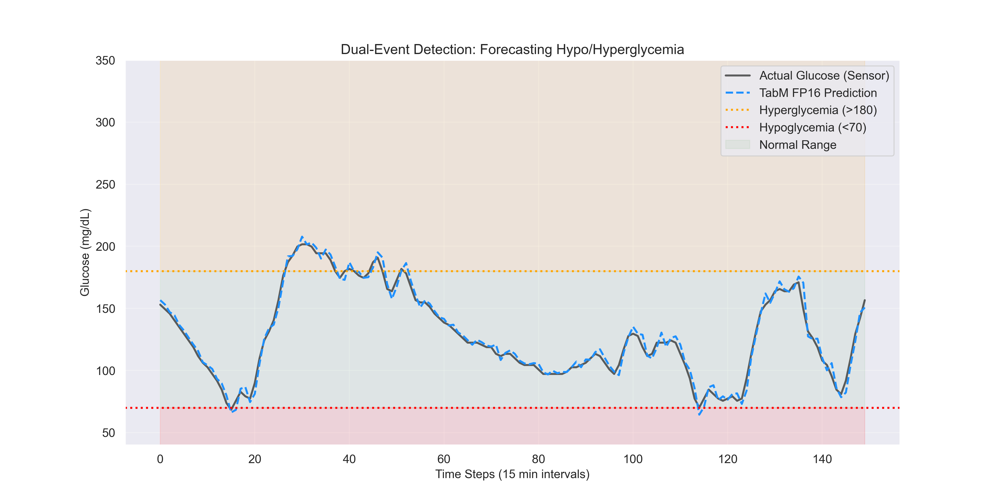
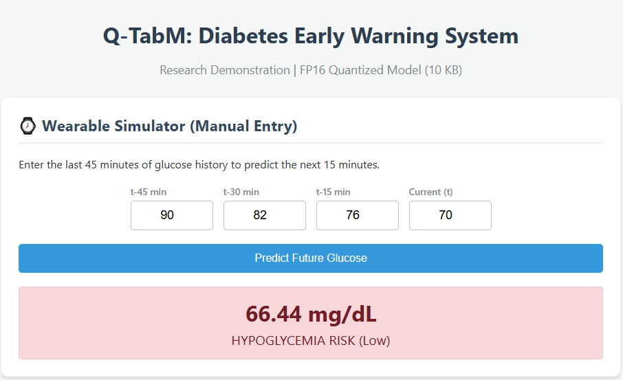
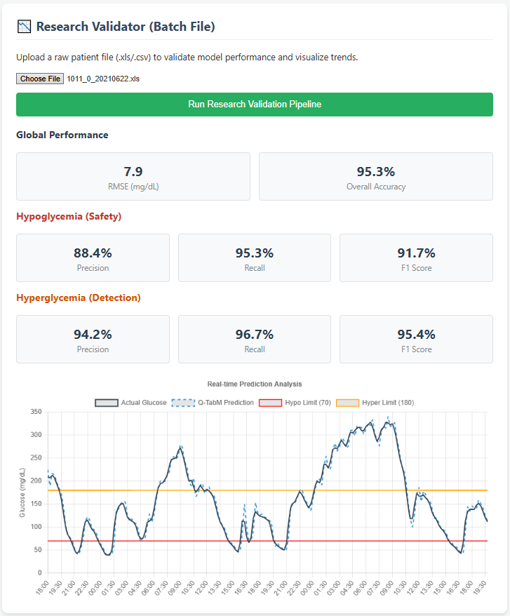

# Q-TabM: Resource-Efficient Early Detection of Diabetic Attacks


## 📌 Research Abstract
This project implements a lightweight Deep Learning framework (**Q-TabM**) for the early detection of diabetic attacks (Hypoglycemia and Hyperglycemia) using Continuous Glucose Monitoring (CGM) data. 

To address the limitations of cloud-dependent solutions, we utilize a **Tabular Multi-prediction (TabM)** architecture tailored for time-series forecasting. The model is optimized using **FP16 Quantization**, achieving a **38% reduction in memory footprint** (~10 KB) with **zero loss** in predictive accuracy, making it suitable for deployment on resource-constrained wearable hardware (TinyML/Edge AI).

---

## 📊 Key Results
The model forecasts glucose levels **15 minutes into the future** to provide an early warning window.

| Metric | Baseline (FP32) | Optimized (FP16) | Impact |
| :--- | :--- | :--- | :--- |
| **RMSE** (Error) | 7.87 mg/dL | 7.93 mg/dL | Negligible Change |
| **Hypo Recall** (Safety) | **96.0%** | **96.0%** | **0% Loss (Perfect Retention)** |
| **Hyper Recall** (Detection) | 94.2% | 94.0% | -0.2% Drop |
| **Model Size** | 16.57 KB | 10.27 KB | **38.0% Reduction** |

### Visual Validation
The model correctly tracks glucose trends into and out of danger zones without false oscillations.



---

## 💻 Web Interface (Demo)
This repository includes a **FastAPI** web server and a **Simulated Wearable Dashboard** to demonstrate the model in real-time.

### 1. Wearable Simulator (Manual Mode)
Simulates a user entering their recent glucose history. The model predicts the future trend and triggers **color-coded alerts** (Red for Hypo, Orange for Hyper).



### 2. Research Validator (Batch Mode)
Upload raw patient data (`.xls`/`.csv`) to run the full preprocessing pipeline, calculate clinical metrics, and visualize the forecast.



---

## ⚙️ Methodology Pipeline
1.  **Data:** Shanghai T1DM Dataset (Minimally Invasive CGM).
2.  **Preprocessing:** Sliding Window approach (`t`, `t-15`, `t-30`, `t-45`) with Linear Interpolation.
3.  **Model:** TabM Regressor with Batch Ensemble layers ($K=4$).
4.  **Validation:** Leave-One-Subject-Out (LOSO) cross-validation on 12 patients.
5.  **Optimization:** Post-Training Quantization (FP16).

---

## 🚀 How to Run Locally

### Prerequisites
*   Python 3.8+
*   Git

### Installation
1.  **Clone the repository:**
    ```bash
    git clone https://github.com/Laam24/Diabetes-Early-Detection-TabM.git
    cd Diabetes-Early-Detection-TabM
    ```

2.  **Install dependencies:**
    ```bash
    pip install -r requirements.txt
    ```

3.  **Start the Inference Server:**
    ```bash
    cd src
    uvicorn main:app --reload
    ```
    *The server will start at `http://127.0.0.1:8000`*

4.  **Launch the Dashboard:**
    *   Navigate to the `web_interface` folder.
    *   Double-click `index.html` to open it in your browser.

---

## 📂 Project Structure
```text
├── data_raw/          # (Not uploaded) Place Shanghai T1DM dataset here
├── data_processed/    # Generated CSVs used for training and validation
├── figures/           # Generated plots, flowcharts, and UI screenshots
├── models/            # Trained PyTorch models (FP32 baseline and FP16 optimized)
├── notebooks/         # Complete Research Pipeline (EDA, Training, Validation)
├── src/               # Source Code
│   ├── inference_engine.py  # Core model definitions & metric logic
│   ├── main.py              # FastAPI Backend Server
│   ├── process_data.py      # Data preprocessing pipeline
│   ├── train.py             # Training loop script
│   └── quantize.py          # Quantization script
├── web_interface/     # Frontend
│   └── index.html           # Interactive Dashboard (HTML/JS)
└── requirements.txt   # Project dependencies
```

## 📜 Citation & References
If you use this work, please reference the Shanghai T1DM Dataset and the TabM architecture.